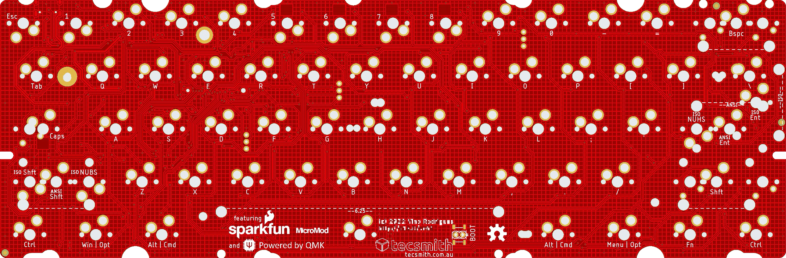
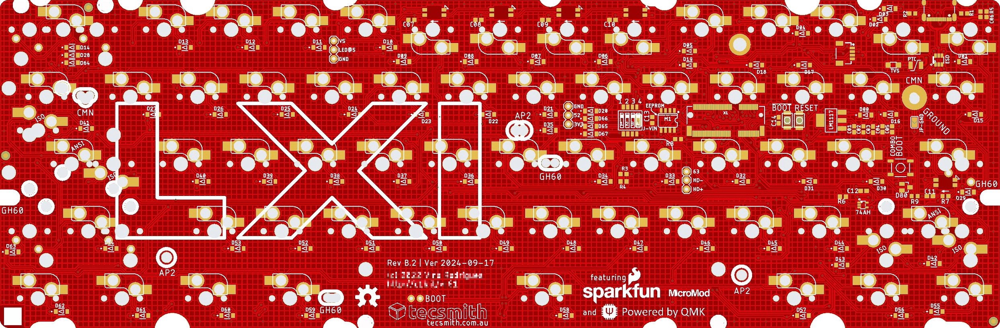

# SR61 - MicroMod 60% Custom Keyboard PCB

![]( https://img.shields.io/badge/-RETIRED-orange.svg?logo=data:image/svg%2bxml;base64,PHN2ZyB4bWxucz0iaHR0cDovL3d3dy53My5vcmcvMjAwMC9zdmciIHZpZXdCb3g9IjAgMCA2NDAgNjQwIj48cGF0aCBkPSJNMzUyIDk2QzM1MiA3OC4zIDMzNy43IDY0IDMyMCA2NEMzMDIuMyA2NCAyODggNzguMyAyODggOTZMMjg4IDMwNEMyODggMzEyLjggMjgwLjggMzIwIDI3MiAzMjBDMjYzLjIgMzIwIDI1NiAzMTIuOCAyNTYgMzA0TDI1NiAxMjhDMjU2IDExMC4zIDI0MS43IDk2IDIyNCA5NkMyMDYuMyA5NiAxOTIgMTEwLjMgMTkyIDEyOEwxOTIgNDAwQzE5MiA0MDEuNSAxOTIgNDAzLjEgMTkyLjEgNDA0LjZMMTMxLjYgMzQ3QzExNS42IDMzMS44IDkwLjMgMzMyLjQgNzUgMzQ4LjRDNTkuNyAzNjQuNCA2MC40IDM4OS43IDc2LjQgNDA1TDE4OC44IDUxMkMyMzEuOSA1NTMuMSAyODkuMiA1NzYgMzQ4LjggNTc2TDM2OCA1NzZDNDY1LjIgNTc2IDU0NCA0OTcuMiA1NDQgNDAwTDU0NCAxOTJDNTQ0IDE3NC4zIDUyOS43IDE2MCA1MTIgMTYwQzQ5NC4zIDE2MCA0ODAgMTc0LjMgNDgwIDE5Mkw0ODAgMzA0QzQ4MCAzMTIuOCA0NzIuOCAzMjAgNDY0IDMyMEM0NTUuMiAzMjAgNDQ4IDMxMi44IDQ0OCAzMDRMNDQ4IDEyOEM0NDggMTEwLjMgNDMzLjcgOTYgNDE2IDk2QzM5OC4zIDk2IDM4NCAxMTAuMyAzODQgMTI4TDM4NCAzMDRDMzg0IDMxMi44IDM3Ni44IDMyMCAzNjggMzIwQzM1OS4yIDMyMCAzNTIgMzEyLjggMzUyIDMwNEwzNTIgOTZ6IiBmaWxsPSIjZWVlIi8+PC9zdmc+)

***Featuring SparkFun's MicroMod Processor Boards***

---

> [PCBWay](https://pcbway.com) had gratefully sponsored the production of the first 5 RevA PCBs, and a partial assembly service.
>
> 
>
> Thank you [PCBWay](https://pcbway.com/)!

Please follow the updates to this production process on the [changelog](CHANGELOG.md) page.

---

Published as Open Source, under a [ Creative Commons Share-alike 4.0 International](LICENSE.md).

### **Rev B** &nbsp; 

> &#128077; **WORKING, OK TO BUILD**

* [PDF Schematic](docs/sr61-revB.2.pdf) 1
* [EAGLE PCB](EAGLE/sr61/sr61-revB.brd)
* [EAGLE Schematic](EAGLE/sr61/sr61-revB.sch)

* Notes:
    - Keymap Working on both STM32 and PR2040
    - *(Optional EEPROM not tested yet)*

> 1 = *RevB.1 schematic is [here](docs/sr61-revB.pdf)*

### **Rev A** &nbsp; 

> &#9888; Do not use this revision, it has terminal flaws.

* ~~[PDF Schematic](docs/sr61-revA.pdf)~~
* ~~EAGLE PCB~~ 2
* ~~EAGLE Schematic~~ 2

> 2 = *to access these files please use the Github history*

### QMK code:

* https://github.com/Tecsmith/sr61-keyboard-qmk
* USB Identifier registered with [pid.codes](https://pid.codes/) = [`1209`/`7672`](https://pid.codes/1209/7672/)

### Layout

* [KLE JSON](./kle/sr61-micromod-poker.json)

*****

## Features

**SR61-MicroMod** - using SparkFun MicroMod STM32 or RP2040 M.2 module

### Core Design Elements

- 60% form factor
    - Design to be compatible with GH60/HK60 cases
    - Also compatible with Anne Pro 2 cases *(~~drop in~~ QMK replacement for existing AP2's or AP2 cases)* *[Removal of battery and minor case cut in the battery compartment required.]*
    - MicroMod positioned in case *"battery compartment"* space.

- QMK + VIA default f/w
    - Wired only *(no wireless)*
    - Default key-maps for Mac users

- User choice of microcontroller
    
    - [STM32 Processor](https://www.sparkfun.com/products/17713) 
        - ARM Cortex-M4, 168MHz, 1MB Flash, 192kB SRAM
        - https://github.com/Tecsmith/sr61-keyboard-qmk

    - [RP2040 Processor](https://www.sparkfun.com/products/17720) 
        - ARM Cortex-M0+, 133MHz, 128Mb Flash (16MB external), 264kB SRAM in six banks
        
- USB-C *(left side)*

    ... but also optional JST connector for [ai03 Unified C3 Daughterboard](https://github.com/ai03-2725/Unified-Daughterboard)

- ESD, Over Voltage and Over Current protection

    ... and cable shield noise filter

- Hot-swap, 5 pin switch slots

- PCB mounted stabs compatibility

- Dual ANSI / ISO layout support

- 61-Key (ANSI) / 62-Key (ISO) Layout [1.25, 1.25, 1.25, **6.25**, 1.25, 1.25, 1.25, 1.25] bottom row *(a.k.a. "Poker" / "POK3R" Layout)*

- Limited RGB LEDs *(SK6812 mini-E)*

    - RGB Caps Lock Indicator

    - North facing RGB's under the `5`, `6`, `7` & `8` keys for layer indicator

    - WS2812/SK6812 breakout for optional external LEDs

- Spare GPIO pins (`52` & `63`) breakout for expansion

   ... e.g., ~~add speaker~~

- Both `[Reset]` and `[Boot]` buttons *(as per MicroMod ref. design)*

    ... plus under space-bar Boot pins for bootload without disassembly *(press while inserting cable for bootloader function)*

---

Made with :heart: by Silvino R.
