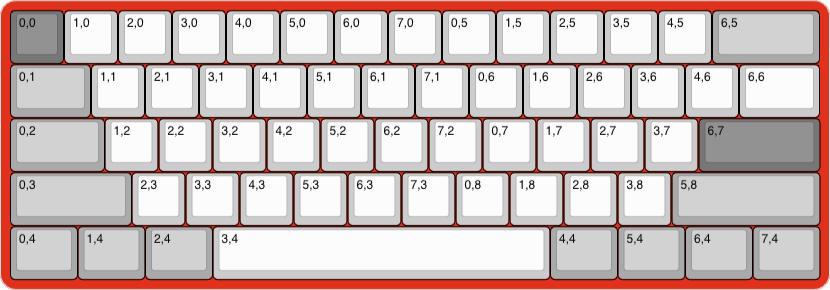

# VR61 *"Goldilocks"* PCB

> &#x26A0; BUCKET LIST PROJECT - not currently under development &#x26A0;

> My first foray into building a full keyboard PCB.  This is very, very early WIP.

> *But for now... here is my wish list / intent list as a "feature" list* :)

## Features

Two 60% PCBs:
* **VR60-MicroMod** - using SparkFun MicroMod STM32 M.2 module, but no RGB
* **VR60-RGB** - integrated STM32 MCU, full per-key RGB

### Core design elements

- 60% form factor
    - Design to be GH60/HK60 compatible *(fits most case and plate combos)*
    - Also compatible with Anne Pro 2 case *(drop in QMK replacement for existing AP2's)*
- QMK + VIA default f/w
    - Wired only *(no wireless)*
    - Default key-maps for Mac use
- STM32 Microcontroller
- USB-C *(left side)*
- ESD protection, over voltage and over current protection
- Hot-swap, 5 pin switch slots
- PCB mounted stabs compatibility
- 1.25, 1.25, 1.25, 6.25, 1.25, 1.25, 1.25, 1.25 bottom row *(a.k.a. "Poker")*
- Per key RGB SMT *(NORTH)* **[VR60-RGB Only]**
    - *(Yes, north because it's more compatible with shine-through caps and I don't buy GMK anyway)*
    - WS2812 or APA102 driver
    - Extra RGB under space - for pudding keycaps / better QMK Matrix animations
    - Extra LED under caps lock (north/offset?) - for caps-lock state
    - Extra LED under bottom row last three (north/offset?) - for layer state indicator
- <s>Under-glow RGB - but as optional *(solder off 0ohm trace switch)*</s>
- Spare GPIO slots for expansion *(e.g. RGB 1-wire extension, etc.)*
- Both [Reset] and [Boot] buttons
    - Under space-bar = reset without disassembly
- Un-obstructive (tiny) status LED(s) under space-bar (next to reset) and near USB port
- Additional EEPROM chip for larger VIA layer support **[VR60-MicroMod module already has this]**
- Footprint for optional speaker (AST1109MLTRQ)
- Optional JST header for connection with USB/Power daughterboard *(e.g. C3 Unified)*
- Optional JST header for CapsLock LED **[VR60-RGB Only]**

### Edge experiments

> May not do - we'll see...

- Layer selector toggle switch in the slot where the AP2 has its wifi-switch - so can be used as a Keychron-esque DIP switch
- Embedded ESP8266 or EP32 chip for over-wifi key-mapping *(is this viable?)*
- Support for Logitec Unifying Reciever or other 2.4GHz module *(how???)*

## Possible design aids

- Closest is the BM60 Poker - but that's not open source.
- [**Acheron Project**](https://github.com/orgs/AcheronProject) - [acheronproject.com](https://acheronproject.com/)
    - [KeebsPCB](https://github.com/AcheronProject/KeebsPCB) &#x26A0;
    - [ArcticPCB](https://github.com/AcheronProject/ArcticPCB)
    - [Tsuki](https://github.com/AcheronProject/Tsuki)
    - [Doddle60](https://github.com/AcheronProject/Doddle60)
- [GH60](https://github.com/komar007/gh60), also [read this](http://blog.komar.be/gh60-evolution/)
- [Bakeneko 60](https://github.com/kkatano/bakeneko-60)
- [Voyager 60](https://github.com/ai03-2725/Voyager60)
- [Plain6-C](https://github.com/evyd13/plain60-c)
- *(a bit off the design footprint)* [Grabert KB](https://github.com/KoBussLLC/grabert-hardware)
- for M.2 example see [github.com/makerdiary/python-keyboard](https://github.com/makerdiary/python-keyboard) & [makerdiary.com/m60](https://makerdiary.com/pages/m60-mechanical-keyboard)

## Progression / Variants

- 3x3 Proof of concept
    - [KLE link](http://www.keyboard-layout-editor.com/#/gists/70eb80593d7909c456c5fbbcb475a0b2)
- VR60 KB Rev 1
    - [KLE link](http://www.keyboard-layout-editor.com/#/gists/c812c931186e45a5acbc3e217ef4f161)

## Tools Used

- Layout
    - [Keyboard Layout Editor](http://www.keyboard-layout-editor.com/)
- Eagle
    - [Kalerator](https://kalerator.clueboard.co/)
- KiCad
    - [@ai03 's PCB Designer Guide](https://wiki.ai03.com/books/pcb-design/chapter/pcb-designer-guide)
    - [@ruiqimao 's Keyboard PCB Guide](https://github.com/ruiqimao/keyboard-pcb-guide)
- Plate
    - [Swill's Plate & Case Builder](http://builder.swillkb.com/)
    - [Keyboard CAD Assistant](http://www.keyboardcad.com/)

---
Made with &#9829; - Vino Rodrigues
